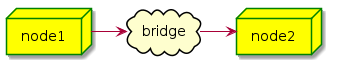

## Usage 

sbs *device* *dst_mac* *message*

## Example 

### Topological graph

   

### Command  

in node1:

```
root@plus:~# git clone https://github.com/babyplus/send_by_string.git

root@plus:~# cd send_by_string

root@plus:~/send_by_string# gcc send_by_string.c -o sbs

root@plus:~/send_by_string# ./sbs enp0s8 "01:80:c2:00:00:34" "8100 2002 | 8902 | 8005 | 80 11 00 00 00 00 00 00 00 00 00 00 00 00 00 00 00 00 02"
08:00:27:d2:31:15
Index for interface enp0s8 is 3 
01:80:c2:00:00:34
8100 2002 | 8902 | 8005 | 80 11 00 00 00 00 00 00 00 00 00 00 00 00 00 00 00 00 02 --> 54
810020028902800580110000000000000000000000000000000002
send num=43,read num=43

```

### Capture

in node2:

```
root@plus:~# tcpdump -i enp0s8 -Xevn
tcpdump: listening on enp0s8, link-type EN10MB (Ethernet), capture size 262144 bytes
07:33:49.434998 08:00:27:d2:31:15 > 01:80:c2:00:00:34, ethertype 802.1Q (0x8100), length 64: vlan 2, p 0, ethertype CFM, CFMv0 Linktrace Message, MD Level 4, length 46
	First TLV offset 17, Flags [Use Forwarding-DB only]
	  Transaction-ID 0x00000000, ttl 0
	  Original-MAC 00:00:00:00:00:00, Target-MAC 00:00:00:00:00:02
	End TLV (0x00)
	0x0000:  8005 8011 0000 0000 0000 0000 0000 0000  ................
	0x0010:  0000 0000 0200 0000 0000 0000 0000 0000  ................
	0x0020:  0000 0000 0000 0000 0000 0000 0000       ..............

```	
